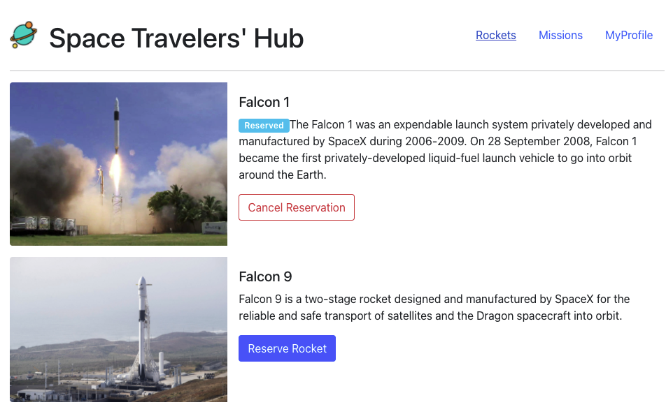
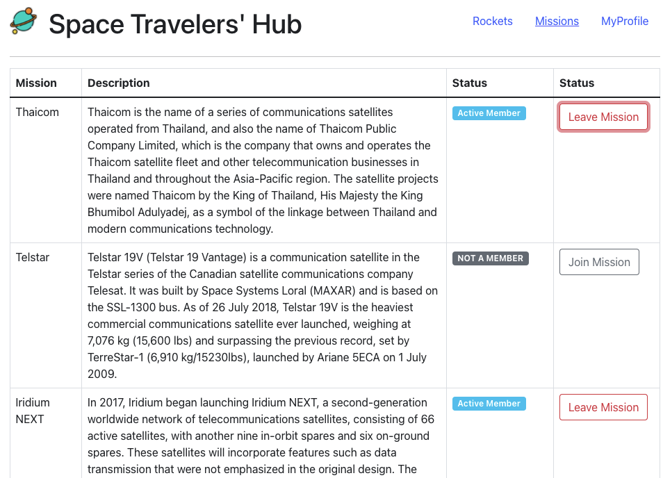
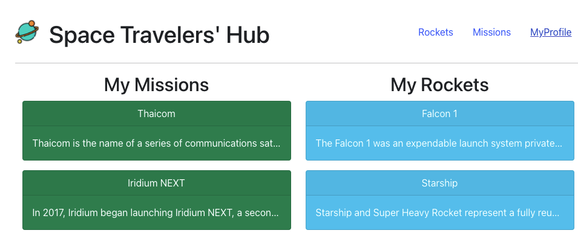

# Space Travelers' Hub

This website will display a list of rockets, missions and reservations.

## Built With

- HTML&CSS
- Javascript
- React & Redux

## Getting Started
To get a local copy up and running follow these simple steps.

## Setup 

### Install
- Open your console and change the current working directory into the destination for this project.
- Type `git clone git@github.com:JasemDuncan/space-travelers-hub.git`
- Run this command in terminal: `npm install`
- Run this command in terminal: `npm start`
- Go in your browser to: http://localhost:3000/

## Authors

👤 **Jasem Duncan Valencia**

- GitHub: [@JasemDuncan](https://github.com/JasemDuncan)
- Twitter: [@JasemDuncan](https://twitter.com/JasemDuncan)
- LinkedIn: [@JasemDuncan](https://www.linkedin.com/in/jasem-duncan-valencia/)
## 🤝 Contributing

Contributions, issues, and feature requests are welcome!

Feel
## Show your support

Give a ⭐️ if you like this project!
## Acknowledgments

- Microverse for the guidelines used for this project
- My SO and project manager, Mane
## 📝 License

This project is [MIT](./LICENSE.md) licensed.
